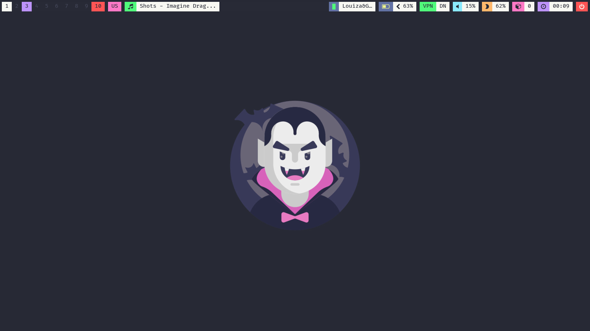
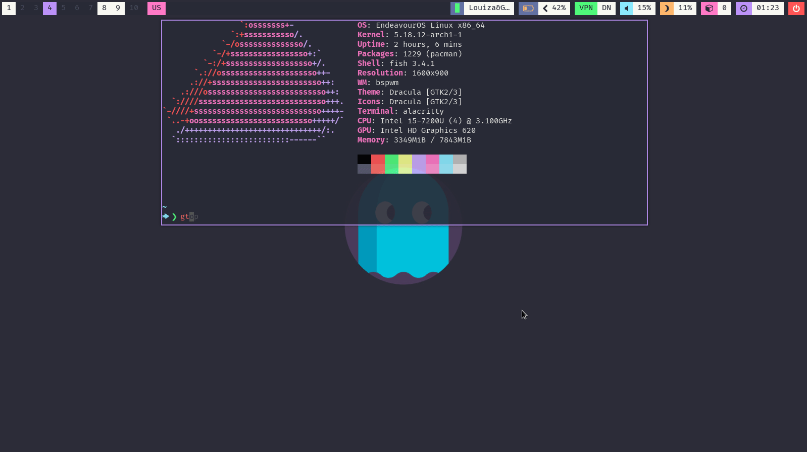
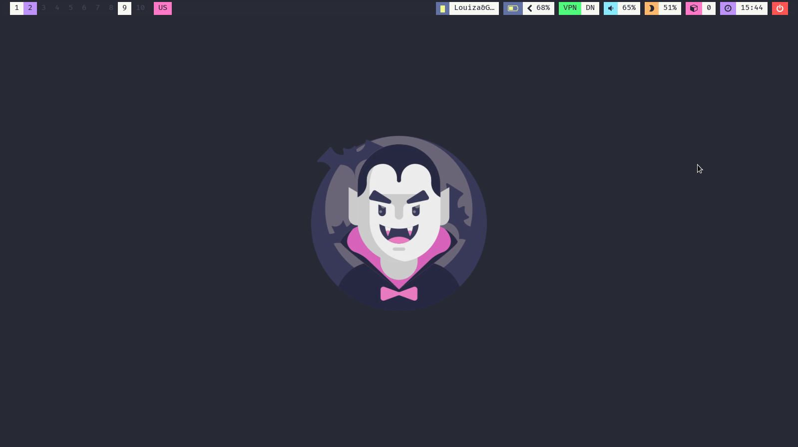
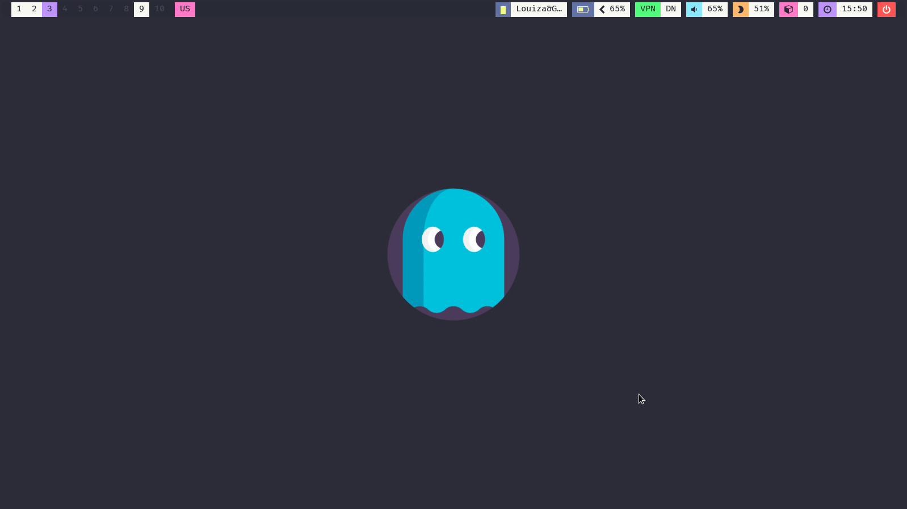

## Welcome



This is my very first attempt to rice Binary Space Partitioning Window Manager (*bspwm*). I am providing a fully <b>working enviroment</b> and a complete [sxhkd cheat-sheet](cheat_sheet.md) to assist the new GNU/Linux user to get familiar with bspwm and understand its full potential. My configuration files include a [Dracula](https://draculatheme.com/) themed polybar with many useful modules. 

In addition, my bspwm supports Scratchpads using the [tdrop](https://github.com/noctuid/tdrop) package.



Please feel free to explore my **Dracula bspwm** configuration files and [sxhkd cheat-sheet](cheat_sheet.md). The [setup section](#setup) will guide you through the step-by-step installation process.

| App Launcher                             | Powermenu                              |
| ---------------------------------------- | -------------------------------------- |
|  |  |

<br/>

Here are some details about my setup:

- **OS:**    [EndaveourOS](https://endeavouros.com/)
- **WM:**    [bspwm](https://github.com/baskerville/bspwm)
- **Bar:**     [polybar](https://github.com/jaagr/polybar)
- **Compositor:**     [picom](https://github.com/yshui/picom)
- **Scratchpads:** [tdrop](https://github.com/noctuid/tdrop)
- **App Launcher:**    [rofi](https://github.com/davatorium/rofi)
- **Log-out screen:**    [archlinux-logout](https://github.com/arcolinux/archlinux-logout)
- **Wallpaper Changer:**    [variety](https://github.com/varietywalls/variety)
- **Terminal:** [alacritty](https://github.com/alacritty/alacritty) 
- **File-manager-1:**    [thunar](https://docs.xfce.org/xfce/thunar/start)
- **File-manager-2:**    [ranger](https://github.com/ranger/ranger)
- **Internet Browser:**    [firefox](https://www.mozilla.org/en-US/firefox/new/)
- **Screen-shot:**   [flameshot](https://github.com/flameshot-org/flameshot)
- **Calendar:**    [calcurse](https://github.com/lfos/calcurse)
- **Music Player:**    [mocp](https://github.com/jonsafari/mocp)
- **E-mail Client:**    [mutt](http://www.mutt.org/)

<br/>

## Setup

> This is step-by-step how to install these bspwm dotfiles. **Please use the guide with caution!**

<br/>

### Installation (Manual)

> Install the necessary dependencies to replicate my setup, if necessary. 

<br/>

<details open>
   <summary><strong>Arch Linux (and Arch-based distributions)</strong></summary>

> Assuming your **AUR Helper** is [yay](https://github.com/Jguer/yay).

```sh
yay -S bspwm sxhkd rofi alacritty tdrop picom-tryone-git calcurse moc-pulse thunar mutt ranger variety \
arcolinux-logout jgmenu betterlockscreen flameshot polybar xfce4-power-manager numlockx blueberry pamac-aur
```

<br/>

> After the dependencies are installed, clone the repository

```sh
# Clone the repository
git clone https://github.com/gcharalampous/bspwm-dracula
cd bspwm-dracula
```

<br/>

> Copy the files to their respective folders.

<details open>
   <summary><strong>Config</strong></summary>

```sh
mkdir -p $HOME/.config/ && rm -rf README.md sxhkdCheatSheet.md screenshots/ .git/ && cp -r ./* $HOME/.config/
```

<br/>

> In case you are installing bspwm for the first time you may need to make these scripts executables and claim ownership. Polybar scripts need also to be executable using the chmod +x command.

```sh
# Make bspwm scripts executables
chmod +x .config/bspwm/*.sh

# Make polybars scripts executables
chmod +x ~/.config/polybar/*.sh ~/.config/polybar/scripts/*.sh
```

<br/>

> You need to install a few fonts to show properly the polybar icons and text.

- **Fira Code:** (https://fonts.google.com/specimen/Fira+Code)

- **Font Awesome:** (https://fontawesome.com/download)

- **Nerd Fonts:** (https://github.com/ryanoasis/nerd-fonts)

```sh
# The fonts
sudo pacman -S ttf-fira-code ttf-font-awesome ttf-nerd-fonts-symbols
```

<br/>

> Once finished copying the files, you might want to finalize the changes to your system.

```sh
# Rebuilds the font cache
fc-cache -fv
```

<br/>

> You may want to install a Dracula GTK theme and Dracula icons. Then you can select the themes by using LXAppearance. In addition, you can install the dracula themes for alacritty, firefox and vim (or neovim).

```sh
# Install GTK Themes
yay -S dracula-gtk-theme-git dracula-icons-git
```

<br/>

> Lastly, log out from your current desktop session and log in into bspwm.

```sh
# Logout from your session
pkill [your-current-session]
```

<br/>

## TO-Do

- [ ] Add Wallpapers.
- [ ] Add Animated .gif Files.
- [ ] Add multi-Monitor Support.

<br/>

## Acknowledgements

- **Thanks to**
  - [ArcoLinux](https://github.com/arcolinux/) for the education videos and configuration files
